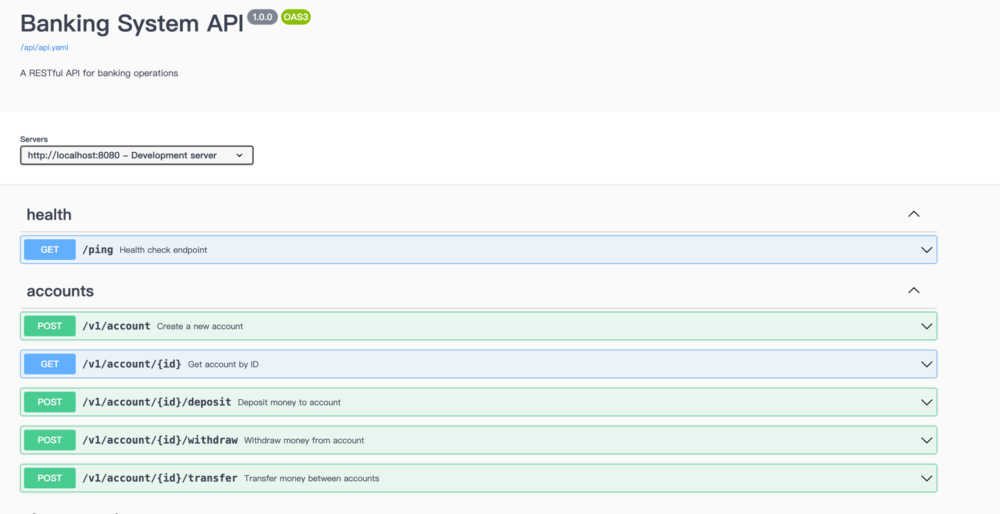

# bank-system 

Golang with gin 實作bank system

> 因為有docker部署需求，且單體服務完成，以快速開發不重複造輪router, middleware架構故套用gin做功能開發

## 流程

```bash
internal - 服務器內部實作, 比照go-zero拆分
  handler - http請求處理層
  service - 業務邏輯處理層
  model - 數據struct(可切換成db結構)
  storage - 記憶體存儲以及控制(repo) 存儲層
  middleware - 中介: logger+traceid
pkg/logger - 自定義log輸出
pkg/config - server配置
pkg/trace - 唯一traceid log追蹤
main 入口
```

## pkg

### config.yaml
yaml管理server配置

```yaml
server:
  port: "8080"
  mode: "debug"

log:
  level: "info"
  format: "json"
  dir: "logs" # 寫入log folder
```

### loggger+traceid

格式化輸出以及追加trace唯一id做日誌追蹤

## test
因為已經有做整合測試，就只先做記憶體操作邏輯
- unit test in storage *_test.go 
- 整合測試 tests/integration_test.go


## install

### Run in local

```bash 
go run server/main.go
```

### Run in docker

```bash
docker-compose up -d
```


## API doc


http://localhost:8080/swagger/index.html



